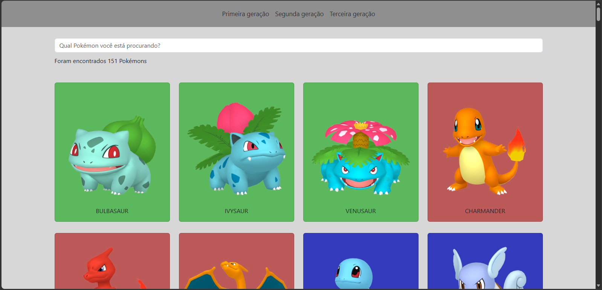

# 🧢 Pokédex Vue 3

Uma aplicação web desenvolvida em **Vue 3** durante os estudos do curso do canal **Ralf Lima**. O projeto consome a **PokéAPI** para exibir os Pokémon das **três primeiras gerações**, organizados em páginas através do **Vue Router**, além de oferecer pesquisa em tempo real e uma interface responsiva utilizando Bootstrap.

## 📸 Preview



---

# 🚀 Tecnologias Utilizadas

* Vue 3 (Composition API)
* Vue Router
* JavaScript (ES6+)
* Bootstrap 5
* HTML5
* CSS3
* PokéAPI

---

# ✨ Funcionalidades

* 🔍 Pesquisa de Pokémon em tempo real.
* 📖 Navegação entre as três primeiras gerações utilizando rotas.
* 📋 Listagem completa dos Pokémon da:

  * 1ª Geração (Kanto)
  * 2ª Geração (Johto)
  * 3ª Geração (Hoenn)
* 🎨 Cards personalizados conforme o tipo principal do Pokémon.
* ⏳ Tela de carregamento durante o consumo da API.
* 📱 Interface responsiva com Bootstrap.
* ⚡ Atualização automática da listagem conforme o usuário digita.

---

# 📦 Consumo da API

O projeto utiliza a API pública da PokéAPI para buscar as informações dos Pokémon.

**API**

https://pokeapi.co/

---

# ⚙️ Como executar o projeto

### Clone o repositório

```bash
git clone https://github.com/elisvaldobraga23/pokedex-vuejs
```

### Acesse a pasta

```bash
cd pokedex-vue
```

### Instale as dependências

```bash
npm install
```

### Execute o projeto

```bash
npm run dev
```

A aplicação estará disponível em:

```
http://localhost:5173
```

---

# 📚 Aprendizados

Durante o desenvolvimento deste projeto foram praticados diversos conceitos importantes do ecossistema Vue:

* Composition API
* `<script setup>`
* `ref()`
* `onMounted()`
* Vue Router
* Rotas entre páginas
* Consumo de APIs com `fetch()`
* Renderização condicional (`v-if`)
* Renderização de listas (`v-for`)
* Two-way Data Binding (`v-model`)
* Classes dinâmicas (`:class`)
* Estados reativos
* Organização de componentes
* Responsividade com Bootstrap

---

# 🎯 Objetivo

O objetivo deste projeto foi colocar em prática os principais conceitos do **Vue 3**, desenvolvendo uma Pokédex funcional que consome uma API REST, utiliza navegação entre páginas por meio do Vue Router e apresenta uma interface moderna e responsiva.

---

# 👨‍🏫 Créditos

Projeto desenvolvido durante os estudos do curso de **Vue 3** do canal **Ralf Lima**, recebendo melhorias e adaptações para reforçar o aprendizado e explorar novos recursos do framework.

---

# 🔗 Links

### 💻 Repositório

https://github.com/elisvaldobraga23/pokedex-vuejs

### 🌐 Deploy

https://dexxpokemon.netlify.app/

---

# 👨‍💻 Autor

**Elisvaldo Braga**

* LinkedIn: https://www.linkedin.com/in/elisvaldo-braga
* Portfólio: https://elisvaldobragadev.netlify.app/ 
